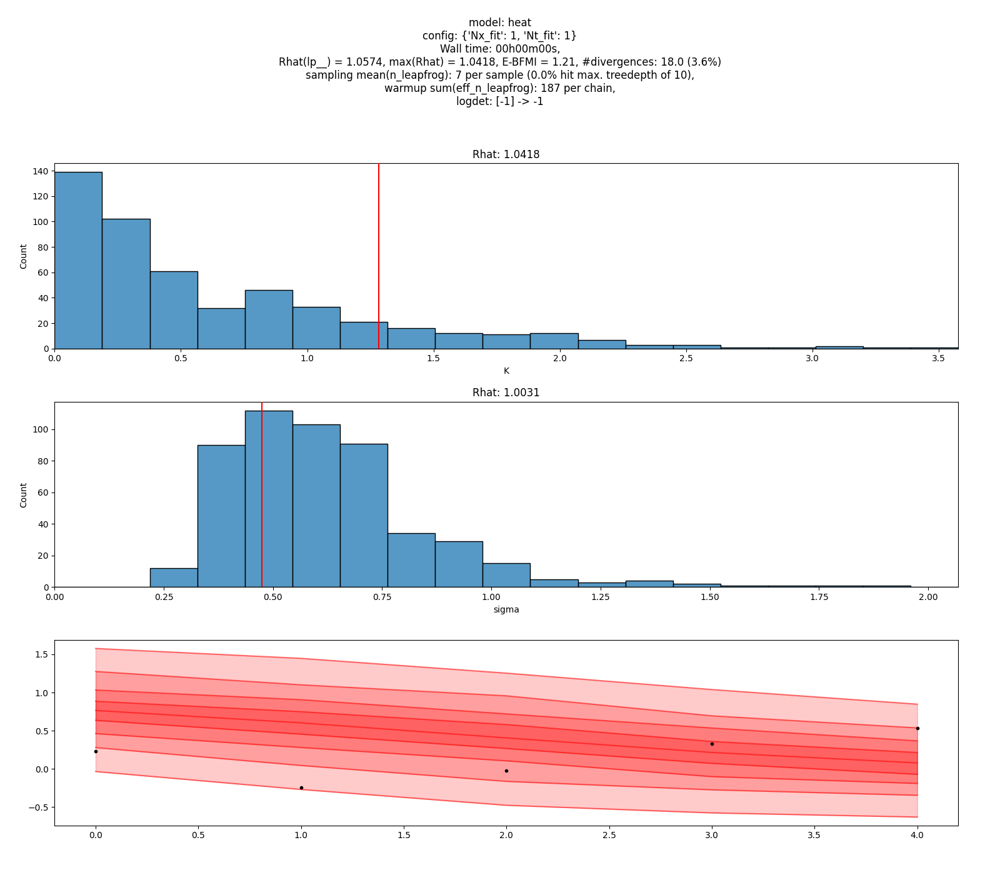
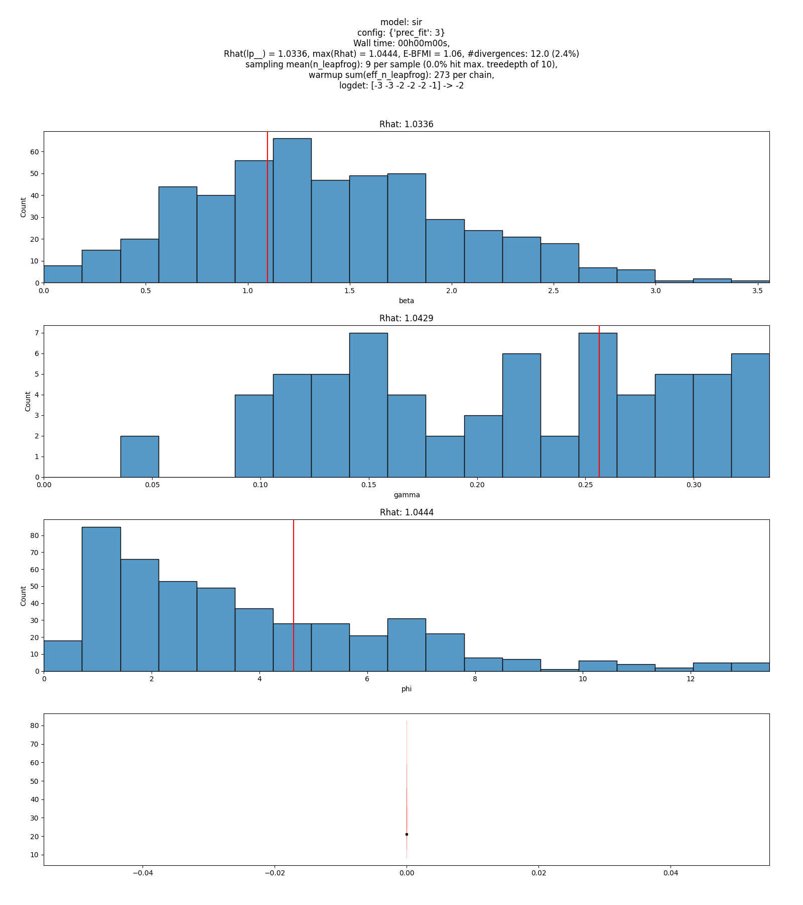

# Automatic refinement for Stan models

We ~~reimplement~~ copy and adapt the models from [this notebook](https://users.aalto.fi/~timonej3/case_study_num.html)
and fit them to 100 simulated datasets using our iterative and adaptive warm-up.

Visualizations for the incremental fits can be found in the folder [`figs/`](figs/).
Stan files are located in the folder [`stan/`](stan/).
The python script to generate fits+animations is [`refinement.py`](refinement.py).
Secret sauce is not included because it's an embarrassing mess.

Files are named as `{model}_{idx}_{goal}.gif` where

* `model` is one of
  * `heat` for the [heat equation](https://users.aalto.fi/~timonej3/case_study_num.html#4_Heat_Equation_Example_(PDE)) or
  * `sir` for the [Susceptible-Infected-Recovered (SIR) model](https://users.aalto.fi/~timonej3/case_study_num.html#3_SIR_example_(ODE)),
* `idx` indicates the id of the simulated dataset and
* `goal` is either `0.99` or `inf`, indicating the "final refinement goal".

During warm-up, the accuracy of the approximation gets successively increased until
`N_eff/N > goal` where `N_eff` is the estimate of the effective sample size
due to importance sampling from the next more accurate posterior, or until
some refinement limit is reached.

## Sample output for the heat equation (`idx == 0`)

### `heat(goal == 0.99)`

### `heat(goal == inf)`

## Sample output for the SIR model (`idx == 0`)

### `sir(goal == 0.99)`

### `sir(goal == inf)`

